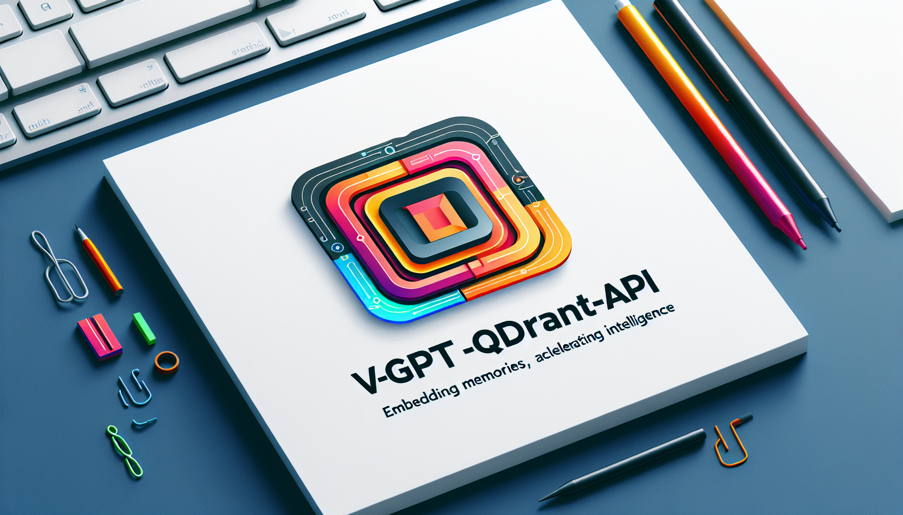

<p align="center">
  
</p>
<p align="center">
    <h1 align="center">V-GPT-QDRANT-API</h1>
</p>
<p align="center">
<<<<<<< HEAD
    <em>Empower Memory with Scalable Vector Intelligence</em>
=======
    <em>Embedding Memories, Accelerating Intelligence.</em>
>>>>>>> main
</p>
<p align="center">
	<!-- local repository, no metadata badges. -->
<p>
<p align="center">
		<em>Developed with the software and tools below.</em>
</p>
<p align="center">
	
	
	
	
	
	
</p>

<br><!-- TABLE OF CONTENTS -->
<details>
  <summary>Table of Contents</summary><br>

- [📍 Overview](#-overview)
<<<<<<< HEAD
  - [Available Models](#available-models)
=======
>>>>>>> main
- [🧩 Features](#-features)
- [🗂️ Repository Structure](#️-repository-structure)
- [📦 Modules](#-modules)
- [🚀 Getting Started](#-getting-started)
<<<<<<< HEAD
- [🛠 Project Roadmap](#-project-roadmap)
=======
  - [⚙️ Installation](#️-installation)
  - [🤖 Usage](#-usage)
  - [🧪 Tests](#-tests)
- [🛠 Project Roadmap](#-project-roadmap)
- [🤝 Contributing](#-contributing)
- [](#)
>>>>>>> main
- [🎗 License](#-license)
</details>
<hr>

## 📍 Overview

<<<<<<< HEAD
The v-gpt-qdrant-api is a FastAPI-based application designed to manage and process memory operations using semantic vector embeddings. By leveraging Qdrant for vector storage and ONNX Runtime for efficient model execution, it facilitates the creation, retrieval, and deletion of memory entities. The project ensures robust interaction between core API services and Qdrant, encapsulating embeddings and memory management functionalities. Its containerized deployment via Docker and environment orchestration through docker-compose seamlessly integrate dependencies, making the system scalable and efficient. This API serves as a powerful tool for applications requiring sophisticated text embedding and memory handling capabilities.

### Available Models

| model                                               | dim  | description                                       | size_in_GB |
| --------------------------------------------------- | ---- | ------------------------------------------------- | ---------- |
| BAAI/bge-small-en-v1.5                              | 384  | Fast and Default English model                    | 0.067      |
| BAAI/bge-small-zh-v1.5                              | 512  | Fast and recommended Chinese model                | 0.090      |
| sentence-transformers/all-MiniLM-L6-v2              | 384  | Sentence Transformer model, MiniLM-L6-v2          | 0.090      |
| snowflake/snowflake-arctic-embed-xs                 | 384  | Based on all-MiniLM-L6-v2 model with only 22m ... | 0.090      |
| jinaai/jina-embeddings-v2-small-en                  | 512  | English embedding model supporting 8192 sequen... | 0.120      |
| snowflake/snowflake-arctic-embed-s                  | 384  | Based on infloat/e5-small-unsupervised, does n... | 0.130      |
| BAAI/bge-small-en                                   | 384  | Fast English model                                | 0.130      |
| BAAI/bge-base-en-v1.5                               | 768  | Base English model, v1.5                          | 0.210      |
| sentence-transformers/paraphrase-multilingual-mpnet | 384  | Sentence Transformer model, paraphrase-multili... | 0.220      |
| BAAI/bge-base-en                                    | 768  | Base English model                                | 0.420      |
| snowflake/snowflake-arctic-embed-m                  | 768  | Based on intfloat/e5-base-unsupervised model, ... | 0.430      |
| jinaai/jina-embeddings-v2-base-en                   | 768  | English embedding model supporting 8192 sequen... | 0.520      |
| nomic-ai/nomic-embed-text-v1                        | 768  | 8192 context length english model                 | 0.520      |
| nomic-ai/nomic-embed-text-v1.5                      | 768  | 8192 context length english model                 | 0.520      |
| snowflake/snowflake-arctic-embed-m-long             | 768  | Based on nomic-ai/nomic-embed-text-v1-unsuperv... | 0.540      |
| mixedbread-ai/mxbai-embed-large-v1                  | 1024 | MixedBread Base sentence embedding model, does... | 0.640      |
| sentence-transformers/paraphrase-multilingual-mpnet | 768  | Sentence-transformers model for tasks like clu... | 1.000      |
| snowflake/snowflake-arctic-embed-l                  | 1024 | Based on intfloat/e5-large-unsupervised, large... | 1.020      |
| BAAI/bge-large-en-v1.5                              | 1024 | Large English model, v1.5                         | 1.200      |
| thenlper/gte-large                                  | 1024 | Large general text embeddings model               | 1.200      |
| intfloat/multilingual-e5-large                      | 1024 | Multilingual model, e5-large. Recommend using ... | 2.240      |

---

## 🧩 Features

|    |   Feature         | Description |
|----|-------------------|---------------------------------------------------------------|
| ⚙️  | **Architecture**  | The project uses a FastAPI framework, coupled with Qdrant for vector storage and ONNX Runtime for model execution. Docker and Docker Compose are used for containerization and orchestration. |
| 🔩 | **Code Quality**  | The code appears modular and structured with single responsibility principles. Various files manage dependencies, models, routes, and main application logic, indicating a clean and maintainable codebase. |
| 📄 | **Documentation** | Documentation is spread across the Dockerfile, docker-compose.yml, requirements.txt, and in-code comments. Each file is well-documented to explain its purpose and usage. |
| 🔌 | **Integrations**  | Integrates with Qdrant for vector storage, ONNX Runtime for model inference, and FastAPI for API management. Utilizes Docker for seamless deployment environments. |
| 🧩 | **Modularity**    | The project is modular, with separate files for dependencies, main app logic, routes, and models. This allows for easy extension and maintenance. |
| 🧪 | **Testing**       | Although specific testing frameworks are not mentioned in the provided details, the project can potentially include tests given the structured nature of the code. |
| ⚡️  | **Performance**   | Performance is optimized using ONNX Runtime for efficient model execution and Uvicorn ASGI server to handle asynchronous operations. Docker ensures efficient resource usage. |
| 🛡️ | **Security**      | API key validation is implemented for secure access. Dependencies like python-dotenv are used for managing environment variables securely. |
| 📦 | **Dependencies**  | Key dependencies include `qdrant-client`, `fastembed`, `python-dotenv`, `uvicorn`, `pydantic`, `numpy`, and `onnxruntime`. Managed through `requirements.txt` and Dockerfile. |
| 🚀 | **Scalability**   | Designed for scalability with Docker to handle containerized deployments and Qdrant for efficient vector operations. FastAPI and Uvicorn facilitate handling increased traffic. |

---

## 🗂️ Repository Structure

```sh
└── v-gpt-qdrant-api/
    ├── Dockerfile
    ├── LICENSE
    ├── README.md
    ├── app
    │   ├── __init__.py
    │   ├── dependencies.py
    │   ├── main.py
    │   ├── models.py
    │   └── routes
    ├── docker-compose.yml
    ├── requirements.txt
    └── v-gpt-qdrant-api.png
```

---

## 📦 Modules

<details closed><summary>.</summary>

| File                                     | Summary                                                                                                                                                                                                                                                                                                                        |
| ---                                      | ---                                                                                                                                                                                                                                                                                                                            |
| [Dockerfile](Dockerfile)                 | Facilitates building and deploying the FastAPI-based application by defining a multi-stage Docker build process, installing dependencies into a virtual environment, and setting up the necessary runtime configuration to ensure efficient execution and scalability of the API server within a containerized environment.    |
| [docker-compose.yml](docker-compose.yml) | Define and orchestrate the applications service architecture by setting up essential containers, dependencies, and configurations. Enable seamless interaction between the core memory API and Qdrant service while managing environment-specific variables and storage volumes for model embeddings and Qdrant data.          |
| [requirements.txt](requirements.txt)     | Specify required dependencies for the FastAPI-based application, enabling the integration of key libraries such as Qdrant for vector storage, ONNX Runtime for model execution, and fastembed for embeddings. Ensure environment variable management with python-dotenv and optimize performance with the Uvicorn ASGI server. |

</details>

<details closed><summary>app</summary>

| File                                   | Summary                                                                                                                                                                                                                                                                                                       |
| ---                                    | ---                                                                                                                                                                                                                                                                                                           |
| [dependencies.py](app/dependencies.py) | Manage the initialization and dependencies for text embedding and Qdrant client, ensuring singleton behavior for the text embedding model. Include API key validation for secure access, tailored for seamless integration within the repository’s FastAPI-based architecture.                                |
| [main.py](app/main.py)                 | Launches a FastAPI application for saving memories with a text embedding feature. Initializes necessary dependencies on startup and conditionally includes specific API routes based on environment variables, aligning with the architectures need for modular and scalable endpoint management.             |
| [models.py](app/models.py)             | Define data models essential for various memory operations such as saving, recalling, creating, deleting, and forgetting memory banks. Implement validation logic to ensure the integrity of input data. Facilitate embedding tasks by providing a structured format for input texts and associated metadata. |

</details>

<details closed><summary>app.routes</summary>

| File                                      | Summary                                                                                                                                                                                                                                                                                                                                |
| ---                                       | ---                                                                                                                                                                                                                                                                                                                                    |
| [embeddings.py](app/routes/embeddings.py) | Manage embedding requests by incrementing a global counter, validating API key dependencies, and leveraging an embedding model to generate vector embeddings. Provides detailed response data including model usage, processing times, and error handling, integral to the overall APIs functionality within the repository structure. |
| [memory.py](app/routes/memory.py)         | Manage memory operations in the v-GPT-Qdrant-API repository by enabling creation, retrieval, storage, and deletion of memory entities in a semantic vector database. Utilizes FastAPI for routing and Qdrant for vector operations, ensuring efficient memory handling and search functionalities.                                     |

</details>

---

## 🚀 Getting Started


## 🛠 Project Roadmap


## 🎗 License

This project is protected under the [MIT License](https://opensource.org/license/mit) License.
=======
The v-gpt-qdrant-api project is a sophisticated API designed to facilitate memory storage and text embedding functionalities, leveraging the FastAPI framework. It integrates with the Qdrant vector database to manage, create, and recall memory operations efficiently. This project includes secure and scalable support for machine learning models and embeddings through well-defined endpoints, ensuring robust management of memory banks and enhancing text processing capabilities. By orchestrating services with Docker, it provides a seamless deployment experience, enabling efficient and secure AI-powered memory and embedding solutions.

---

## 🧩 Features

|     | Feature           | Description                                                                                                                                                                                                                                     |
| --- | ----------------- | ----------------------------------------------------------------------------------------------------------------------------------------------------------------------------------------------------------------------------------------------- |
| ⚙️   | **Architecture**  | The project employs a microservice architecture with FastAPI serving as the primary API framework, integrating a Qdrant vector database for memory storage and text embeddings. Docker and docker-compose are used for container orchestration. |
| 🔩   | **Code Quality**  | The codebase follows clean coding practices with type hints and dependency management using Pydantic models. The repository is well-structured, ensuring maintainability and readability.                                                       |
| 📄   | **Documentation** | Documentation includes detailed `requirements.txt`, `Dockerfile`, and `docker-compose.yml`, providing clear instructions on setup, configuration, and dependencies. In-code comments and docstrings enhance understanding.                      |
| 🔌   | **Integrations**  | Integrates `FastAPI` for the API, `Qdrant` for vector database management, and `onnxruntime` for model inference. Environment management is handled via `python-dotenv`. Docker is used for containerization.                                   |
| 🧩   | **Modularity**    | The codebase is modular, with clear separation of concerns. Different modules handle specific functionalities such as routing, model definitions, and dependencies, enhancing reusability and ease of modification.                             |
| 🧪   | **Testing**       | The use of testing frameworks and tools is not explicitly mentioned in the provided details, suggesting potential areas for improvement in automated testing practices.                                                                         |
| ⚡️   | **Performance**   | Emphasizes efficient performance with asynchronous processing for API endpoints and concurrency management using Uvicorn. Lightweight Docker images and environment-specific configurations further optimize resource usage.                    |
| 🛡️   | **Security**      | Utilizes API key validation for authentication, securing access to endpoints. Environment variables manage sensitive data, ensuring protection against unauthorized access.                                                                     |
| 📦   | **Dependencies**  | Key dependencies include `FastAPI`, `Qdrant-client`, `onnxruntime`, `pydantic`, `numpy`, and `python-dotenv`. Docker-related files such as `Dockerfile` and `docker-compose.yml` manage containers and services.                                |
| 🚀   | **Scalability**   | Designed to handle increased load via asynchronous processing and container orchestration. Docker Compose facilitates scaling services horizontally, ensuring the system can manage higher traffic efficiently.                                 |

---

## 🗂️ Repository Structure

```sh
└── v-gpt-qdrant-api/
    ├── Dockerfile
    ├── LICENSE
    ├── README.md
    ├── app
    │   ├── __init__.py
    │   ├── dependencies.py
    │   ├── main.py
    │   ├── models.py
    │   └── routes
    ├── docker-compose.yml
    ├── images
    │   └── header.png
    └── requirements.txt
```

---

## 📦 Modules

<details closed><summary>.</summary>

| File                                     | Summary                                                                                                                                                                                                                                                                                                                             |
| ---------------------------------------- | ----------------------------------------------------------------------------------------------------------------------------------------------------------------------------------------------------------------------------------------------------------------------------------------------------------------------------------- |
| [requirements.txt](requirements.txt)     | Specify the necessary Python packages for the application, ensuring compatibility and functionality within the FastAPI framework and its dependencies on machine learning, embedding models, and vector search capabilities, which are vital components of the v-gpt-qdrant-api architecture.                                       |
| [docker-compose.yml](docker-compose.yml) | Configure and orchestrate the services for the v-gpt-qdrant-api project, ensuring seamless interaction between the memories-api and the qdrant vector database. Enable settings and volume management for optimal performance, facilitating efficient model embedding and serving capabilities within a Docker environment.         |
| [Dockerfile](Dockerfile)                 | Facilitates building a lightweight Docker image for a FastAPI application, including the installation of dependencies in a virtual environment, copying the application code, setting environment variables, exposing the application port, and configuring Uvicorn to serve the app with specified workers and concurrency limits. |

</details>

<details closed><summary>app</summary>

| File                                   | Summary                                                                                                                                                                                                                                                                                                                                         |
| -------------------------------------- | ----------------------------------------------------------------------------------------------------------------------------------------------------------------------------------------------------------------------------------------------------------------------------------------------------------------------------------------------- |
| [main.py](app/main.py)                 | Main.py initializes the FastAPI application for the AI Memory API, sets up server configurations, and defines startup actions. It includes routing for memory and optional embedding endpoints, leveraging environment variables for conditional configuration. The focus is on facilitating memory storage and text embedding functionalities. |
| [dependencies.py](app/dependencies.py) | Dependencies.py manages initialization and access to a singleton text embedding model, sets up an asynchronous Qdrant client, and verifies API keys for authentication. It plays a crucial role in ensuring efficient and secure handling of embeddings and database connections within the v-gpt-qdrant-api repository architecture.           |
| [models.py](app/models.py)             | Define data models for various memory operations such as saving, recalling, creating, deleting, and forgetting memories. Ensure validation and structure parameters for embedding models. Facilitate seamless integration and operation within the memory management system of the v-gpt-qdrant-api repository.                                 |

</details>

<details closed><summary>app.routes</summary>

| File                                      | Summary                                                                                                                                                                                                                                                                                                                                                                             |
| ----------------------------------------- | ----------------------------------------------------------------------------------------------------------------------------------------------------------------------------------------------------------------------------------------------------------------------------------------------------------------------------------------------------------------------------------- |
| [memory.py](app/routes/memory.py)         | Manage memory operations within the Qdrant vector database, facilitating the creation, saving, recalling, and deletion of memory banks and specific memory entries, while leveraging FastAPI for API routing and asynchronous processing for efficient performance.                                                                                                                 |
| [embeddings.py](app/routes/embeddings.py) | The `app/routes/embeddings.py` file facilitates the creation of text embeddings via an API endpoint. It manages concurrent requests, processes text through a pre-defined embedding model, and returns structured embedding data. It integrates dependencies for API key validation and model access, ensuring secure and efficient operations within the repositorys architecture. |

</details>

---

## 🚀 Getting Started

**System Requirements:**

* **Python**: `version 3.10`

### ⚙️ Installation

<h4>From <code>source</code></h4>

> 1. Clone the v-gpt-qdrant-api repository:
>
> ```console
> $ git clone ../v-gpt-qdrant-api
> ```
>
> 2. Change to the project directory:
> ```console
> $ cd v-gpt-qdrant-api
> ```
>
> 3. Install the dependencies:
> ```console
> $ pip install -r requirements.txt
> ```

### 🤖 Usage

<h4>From <code>source</code></h4>

> Run v-gpt-qdrant-api using the command below:
> ```console
> $ python main.py
> ```

### 🧪 Tests

> Run the test suite using the command below:
> ```console
> $ pytest
> ```

---

## 🛠 Project Roadmap

- [X] `► INSERT-TASK-1`
- [ ] `► INSERT-TASK-2`
- [ ] `► ...`

---

## 🎗 License

This project is protected under the MIT Licence

---

[**Return**](#-overview)

---
>>>>>>> main
