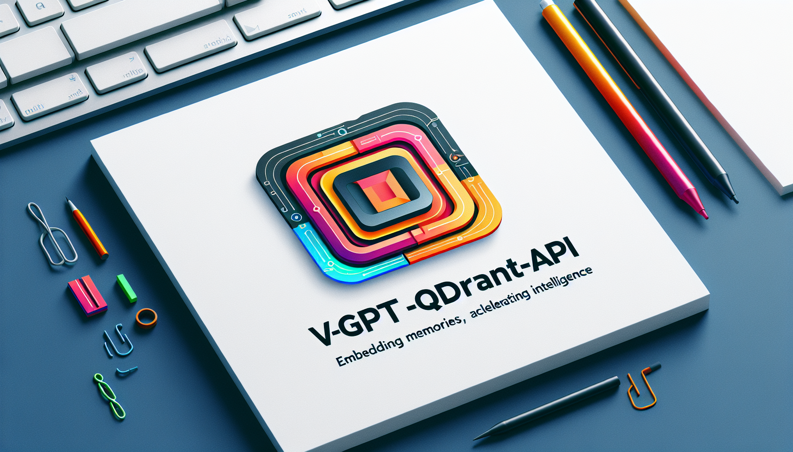

<p align="center">
  
</p>
<h1 align="center">V-GPT-QDRANT-API</h1>
<p align="center">
  <em>Empower Memory with Scalable Vector Intelligence</em>
</p>

<p align="center">
  
  
  
  
  
  
</p>

---

## 📍 Overview

The **v-gpt-qdrant-api** is a FastAPI-based application designed to give AI long-term memory using semantic vector embeddings and Qdrant for vector storage.  

It provides:  
- Memory management (save, recall, forget).  
- An OpenAI-compatible embeddings endpoint.  
- Integration with open-source embedding models.  
- Dockerized deployment for portability.  

The system uses **FastEmbed** for efficient vector generation and a **singleton pattern** for embedding models to reduce RAM/CPU load. Even on low-end hardware, it can generate multiple embeddings per second.  

---

## 🧩 Features

- **Embedding Endpoint**: Drop-in OpenAI-compatible `/v1/embeddings` endpoint.  
- **Memory Management**: Create collections, save entries with entities/tags/sentiments, recall by context.  
- **Advanced Search**: Filter by context, sentiment, or entities for precise retrieval.  
- **API Docs**: Auto-generated at `/openapi.json`.  
- **Configurable Models**: Use small fast models (384-dim) or larger commercial-grade equivalents (768–1024 dim).  
- **Dockerized**: Fully containerized with `docker-compose`.  

---

## 🗂 Repository Structure

```sh
v-gpt-qdrant-api/
├── Dockerfile
├── docker-compose.yml
├── requirements.txt
├── LICENSE
├── README.md
└── app/
    ├── main.py
    ├── models.py
    ├── dependencies.py
    └── routes/
        ├── memory.py
        └── embeddings.py
```

---

## 📦 Setup & Environment

Example environment configuration (`.env`):

```yaml
QDRANT_HOST=http://qdrant:6333
BASE_URL=http://memories-api
QDRANT_API_KEY=
MEMORIES_API_KEY=
WORKERS=1
UVICORN_CONCURRENCY=64
EMBEDDING_ENDPOINT=True
LOCAL_MODEL=BAAI/bge-small-en-v1.5
DIM=384
```

Run with:

```sh
docker-compose up -d
```

---

## 📑 Available Models

| model                                   | dim  | description                           | size_in_GB |
|-----------------------------------------|------|---------------------------------------|------------|
| BAAI/bge-small-en-v1.5                  | 384  | Fast and default English              | 0.067      |
| BAAI/bge-small-zh-v1.5                  | 512  | Fast, recommended Chinese             | 0.090      |
| sentence-transformers/all-MiniLM-L6-v2  | 384  | MiniLM-L6 sentence transformer        | 0.090      |
| nomic-ai/nomic-embed-text-v1.5          | 768  | Large 8192 context English model      | 0.520      |
| BAAI/bge-large-en-v1.5                  | 1024 | Large English model                   | 1.200      |
| intfloat/multilingual-e5-large          | 1024 | Multilingual large model              | 2.240      |

*(full model list supported — see docs)*

---

## 🚀 Endpoints

- **POST `/manage_memories/`**: Create/delete collections or forget memories.  
- **POST `/save_memory/`**: Save a memory with sentiment/entities/tags.  
- **POST `/recall_memory/`**: Retrieve relevant memories.  
- **POST `/v1/embeddings/`**: Generate embeddings via local model.  

OpenAPI spec at:  
`http://BASE_URL:8077/openapi.json`

---

## 🎗 License
MIT License. See [LICENSE](LICENSE).  
