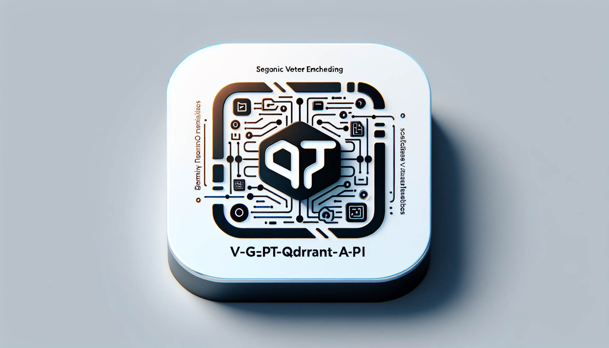

<p align="center">
  
</p>
<p align="center">
    <h1 align="center">V-GPT-QDRANT-API</h1>
</p>
<p align="center">
    <em>Embedding Memories, Accelerating Intelligence.</em>
</p>
<p align="center">
	<!-- local repository, no metadata badges. -->
<p>
<p align="center">
		<em>Developed with the software and tools below.</em>
</p>
<p align="center">
	
	
	
	
	
	
</p>

<br><!-- TABLE OF CONTENTS -->
<details>
  <summary>Table of Contents</summary><br>

- [📍 Overview](#-overview)
- [🧩 Features](#-features)
- [🗂️ Repository Structure](#️-repository-structure)
- [📦 Modules](#-modules)
- [🚀 Getting Started](#-getting-started)
  - [⚙️ Installation](#️-installation)
  - [🤖 Usage](#-usage)
  - [🧪 Tests](#-tests)
- [🛠 Project Roadmap](#-project-roadmap)
- [🤝 Contributing](#-contributing)
- [](#)
- [🎗 License](#-license)
</details>
<hr>

## 📍 Overview

The v-gpt-qdrant-api project is a sophisticated API designed to facilitate memory storage and text embedding functionalities, leveraging the FastAPI framework. It integrates with the Qdrant vector database to manage, create, and recall memory operations efficiently. This project includes secure and scalable support for machine learning models and embeddings through well-defined endpoints, ensuring robust management of memory banks and enhancing text processing capabilities. By orchestrating services with Docker, it provides a seamless deployment experience, enabling efficient and secure AI-powered memory and embedding solutions.

---

## 🧩 Features

|     | Feature           | Description                                                                                                                                                                                                                                     |
| --- | ----------------- | ----------------------------------------------------------------------------------------------------------------------------------------------------------------------------------------------------------------------------------------------- |
| ⚙️   | **Architecture**  | The project employs a microservice architecture with FastAPI serving as the primary API framework, integrating a Qdrant vector database for memory storage and text embeddings. Docker and docker-compose are used for container orchestration. |
| 🔩   | **Code Quality**  | The codebase follows clean coding practices with type hints and dependency management using Pydantic models. The repository is well-structured, ensuring maintainability and readability.                                                       |
| 📄   | **Documentation** | Documentation includes detailed `requirements.txt`, `Dockerfile`, and `docker-compose.yml`, providing clear instructions on setup, configuration, and dependencies. In-code comments and docstrings enhance understanding.                      |
| 🔌   | **Integrations**  | Integrates `FastAPI` for the API, `Qdrant` for vector database management, and `onnxruntime` for model inference. Environment management is handled via `python-dotenv`. Docker is used for containerization.                                   |
| 🧩   | **Modularity**    | The codebase is modular, with clear separation of concerns. Different modules handle specific functionalities such as routing, model definitions, and dependencies, enhancing reusability and ease of modification.                             |
| 🧪   | **Testing**       | The use of testing frameworks and tools is not explicitly mentioned in the provided details, suggesting potential areas for improvement in automated testing practices.                                                                         |
| ⚡️   | **Performance**   | Emphasizes efficient performance with asynchronous processing for API endpoints and concurrency management using Uvicorn. Lightweight Docker images and environment-specific configurations further optimize resource usage.                    |
| 🛡️   | **Security**      | Utilizes API key validation for authentication, securing access to endpoints. Environment variables manage sensitive data, ensuring protection against unauthorized access.                                                                     |
| 📦   | **Dependencies**  | Key dependencies include `FastAPI`, `Qdrant-client`, `onnxruntime`, `pydantic`, `numpy`, and `python-dotenv`. Docker-related files such as `Dockerfile` and `docker-compose.yml` manage containers and services.                                |
| 🚀   | **Scalability**   | Designed to handle increased load via asynchronous processing and container orchestration. Docker Compose facilitates scaling services horizontally, ensuring the system can manage higher traffic efficiently.                                 |

---

## 🗂️ Repository Structure

```sh
└── v-gpt-qdrant-api/
    ├── Dockerfile
    ├── LICENSE
    ├── README.md
    ├── app
    │   ├── __init__.py
    │   ├── dependencies.py
    │   ├── main.py
    │   ├── models.py
    │   └── routes
    ├── docker-compose.yml
    ├── images
    │   └── header.png
    └── requirements.txt
```

---

## 📦 Modules

<details closed><summary>.</summary>

| File                                     | Summary                                                                                                                                                                                                                                                                                                                             |
| ---------------------------------------- | ----------------------------------------------------------------------------------------------------------------------------------------------------------------------------------------------------------------------------------------------------------------------------------------------------------------------------------- |
| [requirements.txt](requirements.txt)     | Specify the necessary Python packages for the application, ensuring compatibility and functionality within the FastAPI framework and its dependencies on machine learning, embedding models, and vector search capabilities, which are vital components of the v-gpt-qdrant-api architecture.                                       |
| [docker-compose.yml](docker-compose.yml) | Configure and orchestrate the services for the v-gpt-qdrant-api project, ensuring seamless interaction between the memories-api and the qdrant vector database. Enable settings and volume management for optimal performance, facilitating efficient model embedding and serving capabilities within a Docker environment.         |
| [Dockerfile](Dockerfile)                 | Facilitates building a lightweight Docker image for a FastAPI application, including the installation of dependencies in a virtual environment, copying the application code, setting environment variables, exposing the application port, and configuring Uvicorn to serve the app with specified workers and concurrency limits. |

</details>

<details closed><summary>app</summary>

| File                                   | Summary                                                                                                                                                                                                                                                                                                                                         |
| -------------------------------------- | ----------------------------------------------------------------------------------------------------------------------------------------------------------------------------------------------------------------------------------------------------------------------------------------------------------------------------------------------- |
| [main.py](app/main.py)                 | Main.py initializes the FastAPI application for the AI Memory API, sets up server configurations, and defines startup actions. It includes routing for memory and optional embedding endpoints, leveraging environment variables for conditional configuration. The focus is on facilitating memory storage and text embedding functionalities. |
| [dependencies.py](app/dependencies.py) | Dependencies.py manages initialization and access to a singleton text embedding model, sets up an asynchronous Qdrant client, and verifies API keys for authentication. It plays a crucial role in ensuring efficient and secure handling of embeddings and database connections within the v-gpt-qdrant-api repository architecture.           |
| [models.py](app/models.py)             | Define data models for various memory operations such as saving, recalling, creating, deleting, and forgetting memories. Ensure validation and structure parameters for embedding models. Facilitate seamless integration and operation within the memory management system of the v-gpt-qdrant-api repository.                                 |

</details>

<details closed><summary>app.routes</summary>

| File                                      | Summary                                                                                                                                                                                                                                                                                                                                                                             |
| ----------------------------------------- | ----------------------------------------------------------------------------------------------------------------------------------------------------------------------------------------------------------------------------------------------------------------------------------------------------------------------------------------------------------------------------------- |
| [memory.py](app/routes/memory.py)         | Manage memory operations within the Qdrant vector database, facilitating the creation, saving, recalling, and deletion of memory banks and specific memory entries, while leveraging FastAPI for API routing and asynchronous processing for efficient performance.                                                                                                                 |
| [embeddings.py](app/routes/embeddings.py) | The `app/routes/embeddings.py` file facilitates the creation of text embeddings via an API endpoint. It manages concurrent requests, processes text through a pre-defined embedding model, and returns structured embedding data. It integrates dependencies for API key validation and model access, ensuring secure and efficient operations within the repositorys architecture. |

</details>

---

## 🚀 Getting Started

**System Requirements:**

* **Python**: `version 3.10`

### ⚙️ Installation

<h4>From <code>source</code></h4>

> 1. Clone the v-gpt-qdrant-api repository:
>
> ```console
> $ git clone ../v-gpt-qdrant-api
> ```
>
> 2. Change to the project directory:
> ```console
> $ cd v-gpt-qdrant-api
> ```
>
> 3. Install the dependencies:
> ```console
> $ pip install -r requirements.txt
> ```

### 🤖 Usage

<h4>From <code>source</code></h4>

> Run v-gpt-qdrant-api using the command below:
> ```console
> $ python main.py
> ```

### 🧪 Tests

> Run the test suite using the command below:
> ```console
> $ pytest
> ```

---

## 🛠 Project Roadmap

- [X] `► INSERT-TASK-1`
- [ ] `► INSERT-TASK-2`
- [ ] `► ...`

---

## 🎗 License

This project is protected under the MIT Licence

---

[**Return**](#-overview)

---
